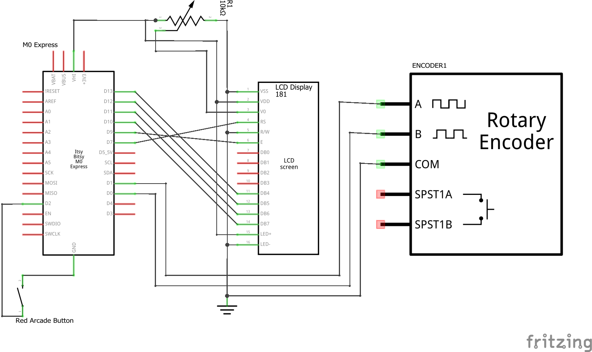

# Installation Guide
The following document gives a walk-through of how to build and setup up the software and hardware. Links are also provided for further reference. Many thanks to the Adafruit website and creators, because of which this project is possible.

## Hardware
### Mechanical
The largest piece of this project is the housing, given as a top and bottom part. The bottom part holds the ItsyBitsy M0 Express board and is connected to the top part by four M5 screws. The top part holds the button (no need for modeled threads, button comes with plastic nut), LCD display connected using four M3 screws, and the rotary encoder connected using a washer and nut. Assembling these pieces is straightforward, with a note to be careful about snapping the M0 Express board into place.

### Electrical
The following schematic should be used with the default configuration of the code.


A summary of the connections is as follows
#### Arcade Button
* Bottom pin to `GND`
* Side pin to `BOARD-D02`
Reference: [https://learn.adafruit.com/ninja-timer-giant-7-segment-display/wire-the-buttons](https://learn.adafruit.com/ninja-timer-giant-7-segment-display/wire-the-buttons)

#### LCD Display
* `LCD-01` -> `GND`
* `LCD-02` -> `BOARD-VHI`
* `LCD-03` -> `10kTRIM-Wiper`
* `LCD-04` -> `BOARD-D07`
* `LCD-05` -> `GND`
* `LCD-06` -> `BOARD-D09`
* `LCD-07..LCD-10` -> No connection
* `LCD-11` -> `BOARD-D13`
* `LCD-12` -> `BOARD-D12`
* `LCD-13` -> `BOARD-D11`
* `LCD-14` -> `BOARD-D10`
* `LCD-15` -> `BOARD-VHI`
* `LCD-16` -> `GND`
Reference: [https://learn.adafruit.com/character-lcds/wiring-a-character-lcd](https://learn.adafruit.com/character-lcds/wiring-a-character-lcd)

#### 10k Trim Potentiometer
* Outer pins to `BOARD-VHI` and `GND` (arbitrary arrangement)
* Center pin to `LCD-03`

#### Rotary Encoder
* `RE-A` -> `BOARD-D1`
* `RE-B` -> `BOARD-D0`
* `RE-COM` -> `GND` (center pin)
Also connection for button possible (not implemented in the code currently)
Reference: [https://learn.adafruit.com/bluetooth-le-hid-volume-knob-with-circuitpython/build-the-ble-volume-knob](https://learn.adafruit.com/bluetooth-le-hid-volume-knob-with-circuitpython/build-the-ble-volume-knob)

## Software
The best software guide is found at Adafruit for the ItsyBitsy M0 Express: [https://learn.adafruit.com/introducing-itsy-bitsy-m0/overview](https://learn.adafruit.com/introducing-itsy-bitsy-m0/overview). Here, the guide is summarized with some quick troubleshooting. The bootloader and CircuitPython files are also provided in this repository in the `src/board-init/` directory.

### First Time Setup
When the ItsyBitsy M0 Express board is first plugged in to the computer, double-click the reset button on the board to enter the boot volume called `ITSYBOOT`. Drag the `adafruit-circuitpython-itsybitsy_m0_express-en_US-8.2.5.uf2` file (in `src/board-init/`) to the boot volume. The M0 Express should restart and a new volume called `CIRCUITPY` should appear.

The Bootloader may need to be updated. If this is the case, double-click the reset button and drag the `update-bootloader-itsybitsy_m0-v3.15.0.uf2` file to the boot volume instead of the circuit python file. Once the M0 Express restarts, drag the circuit python `uf2` file back onto the boot volume as before.

A more complete overview of CircuitPython install is found at [https://learn.adafruit.com/welcome-to-circuitpython/installing-circuitpython](https://learn.adafruit.com/welcome-to-circuitpython/installing-circuitpython). The latest CircuitPython and Bootloader files can be downloaded from [https://circuitpython.org/board/itsybitsy_m0_express/](https://circuitpython.org/board/itsybitsy_m0_express/).

### Running Code
The simplest setup is to drag the contents of the `src/all-in-one/` directory to the `CIRCUITPY` drive. This adds the required libraries and overwrites the default `code.py` script. Adafruit recommends to edit the python code directly on the `CIRCUITPY` volume using the Mu editor (more information [https://learn.adafruit.com/welcome-to-circuitpython/recommended-editors](https://learn.adafruit.com/welcome-to-circuitpython/recommended-editors)).

### Troubleshooting
If a bootloader for a different board was accidentally loaded instead of the ItsyBitsy M0 Express bootloader, the board's internal storage must be cleared and the new bootloader re-uploaded. If the board's REPL (read, evaluate, print, loop) is accessible, simply run the following two lines of code:
```python
import storage
storage.erase_filesystem()
```
If the issue is not solved, please refer to [https://learn.adafruit.com/introducing-itsy-bitsy-m0/troubleshooting](https://learn.adafruit.com/introducing-itsy-bitsy-m0/troubleshooting).

Occasionally, some scripts may fail to allocate enough memory for the program. Using `mpy` files for libraries and well-optimized code helps reduce memory allocation errors. To check free and allocated memory, the following lines of code can be used:
```python
import gc
gc.mem_free()
gc.mem_alloc()
```
